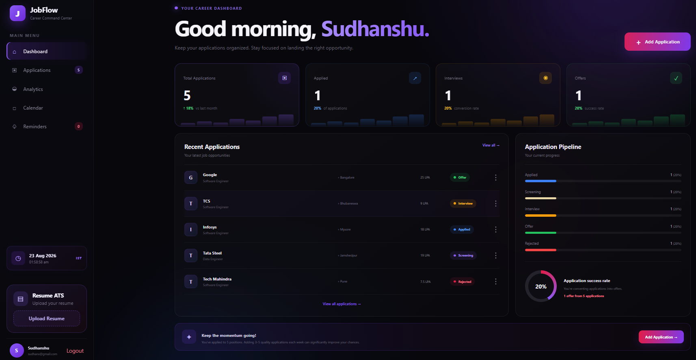

<div align="center">

# 🚀 JobFlow
### Your Career Command Center

**Track applications. Analyze resumes. Manage your entire job search — from one place.**

[](https://job-flow-amber.vercel.app)
[](https://jobflow-g3ww.onrender.com/docs)

<br/>


</div>

<br/>

## 🎯 Why JobFlow?

Job hunting gets chaotic fast — applications scattered across spreadsheets, emails, browser tabs, and sticky notes.

> *"Where did I apply?"* · *"What was the status of that one?"* · *"Did I already apply here?"* · *"Is my resume even good enough?"*

**JobFlow answers all of it from a single, centralized workspace.**

---

## 📸 Screenshot

<p align="center">
  
</p>


---

## ✨ Features

<table>
<tr>
<td width="50%" valign="top">

### 🔐 Secure Authentication
- Register & login with JWT
- Persistent sessions via browser storage
- Protected, user-scoped data
- Authenticated API requests throughout

</td>
<td width="50%" valign="top">

### 💼 Application Management
- Create, view, update & delete applications
- Track company, role, location, salary & status
- Live dashboard stats & application pipeline view
- Full CRUD from a single interface

</td>
</tr>
<tr>
<td width="50%" valign="top">

### 📄 Resume ATS Analyzer
- Upload a resume and get an ATS score
- `POST /resume/ats-score`

</td>
<td width="50%" valign="top">

### 📊 Career Analytics
- Application status distribution
- Application → Interview → Offer funnel
- Response rate tracking
- Salary insights across applications

</td>
</tr>
</table>

---

## 🧠 Architecture

```text
                         ┌─────────────────────┐
                         │        USER          │
                         │   Browser / Mobile    │
                         └───────────┬───────────┘
                                     │
                                     ▼
                         ┌─────────────────────┐
                         │   React + Vite        │
                         │      Frontend         │
                         └───────────┬───────────┘
                                     │
                               REST API calls
                                     │
                                     ▼
                         ┌─────────────────────┐
                         │       FastAPI          │
                         │       Backend          │
                         └───────────┬───────────┘
                                     │
            ┌────────────────────────┼────────────────────────┐
            │                        │                        │
            ▼                        ▼                        ▼
   ┌─────────────────┐    ┌─────────────────┐    ┌─────────────────┐
   │ Authentication    │    │  Job Manager      │    │  ATS Analyzer     │
   │       JWT          │    │   CRUD API        │    │    Resume          │
   └─────────────────┘    └────────┬────────┘    └─────────────────┘
                                     │
                                     ▼
                          ┌─────────────────┐
                          │     Database      │
                          │   (PostgreSQL)     │
                          └─────────────────┘
```

---

## 🛠️ Tech Stack

| Layer | Technology |
|---|---|
| **Frontend** | React, Vite |
| **Backend** | FastAPI (Python) |
| **Auth** | JWT-based authentication |
| **Database** | PostgreSQL |
| **Hosting** | Vercel (frontend) · Render (backend) |

---

## 🔄 How It Works

```text
User
 ↓
React Frontend
 ↓
JWT Authentication
 ↓
FastAPI REST API
 ↓
PostgreSQL Database
 ↓
Response
 ↓
React Dashboard
```

Users authenticate through the FastAPI backend, receive a JWT token, and use authenticated API requests to manage their job applications and resume analysis.

---

## 🚦 Quick Start

```bash
# 1. Clone the repo
git clone https://github.com/CodeWithSudhanshu/jobFlow.git
cd jobFlow

# 2. Backend setup
cd backend
python -m venv venv
venv\Scripts\activate      # Windows
# source venv/bin/activate # macOS/Linux
pip install -r requirements.txt
uvicorn src.main:app --reload --port 8000

# 3. Frontend setup (in a new terminal)
cd frontend
npm install
npm run dev
```

Then open `http://localhost:5173` in your browser. 🎉

---

## 🌐 Live Links

| | |
|---|---|
| **Frontend** | [job-flow-amber.vercel.app](https://job-flow-amber.vercel.app) |
| **Backend API** | [jobflow-g3ww.onrender.com](https://jobflow-g3ww.onrender.com) |
| **API Docs (Swagger)** | [jobflow-g3ww.onrender.com/docs](https://jobflow-g3ww.onrender.com/docs) |

---

## 🗺️ Roadmap

- [x] JWT authentication
- [x] Job application CRUD
- [x] Resume ATS scoring
- [x] Career analytics dashboard
- [x] Production deployment
- [ ] Interview scheduling
- [ ] Resume improvement suggestions
- [ ] AI-powered career assistant

---

## 👨‍💻 Author

**Sudhanshu Sharma**
[GitHub @CodeWithSudhanshu](https://github.com/CodeWithSudhanshu)

---

<div align="center">

**Built to make job hunting feel like less of a mess.**

</div>
